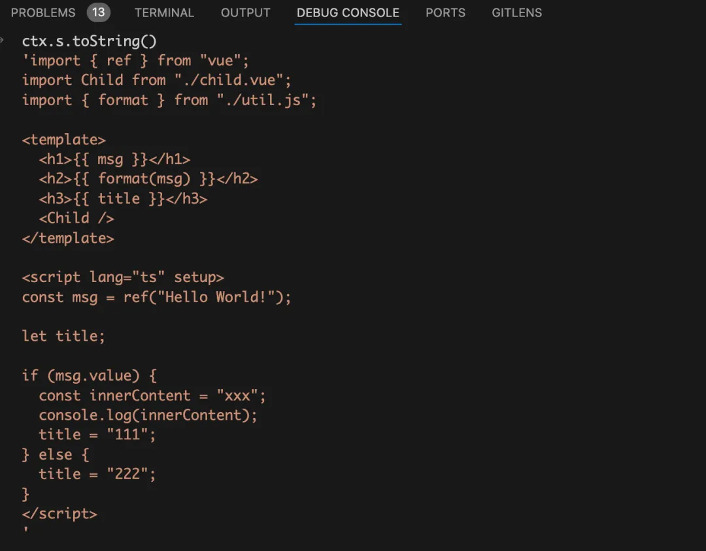
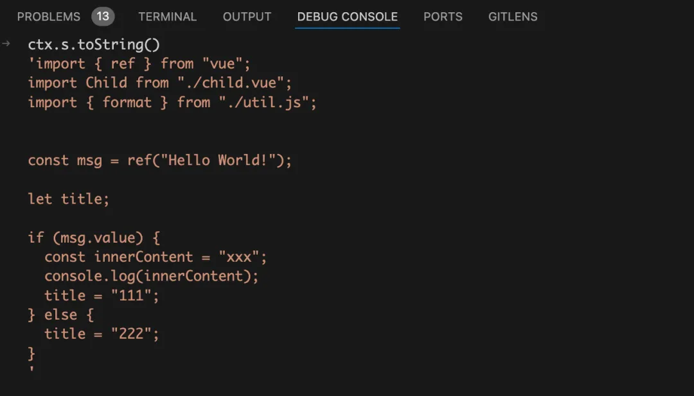
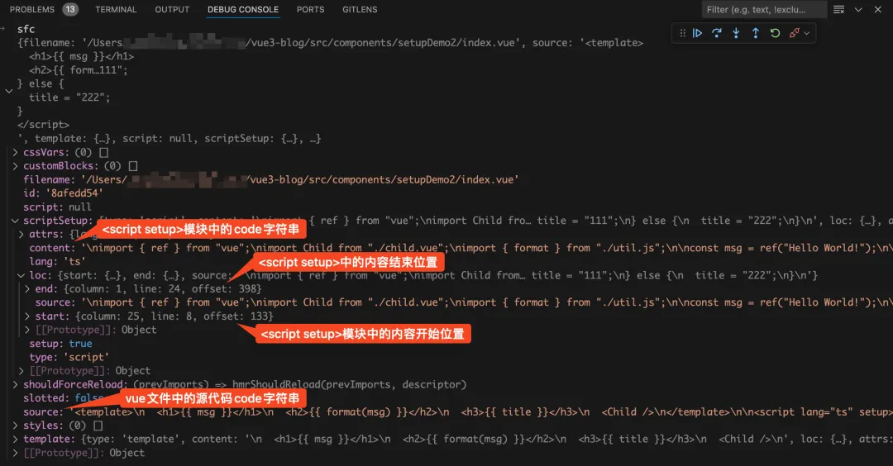
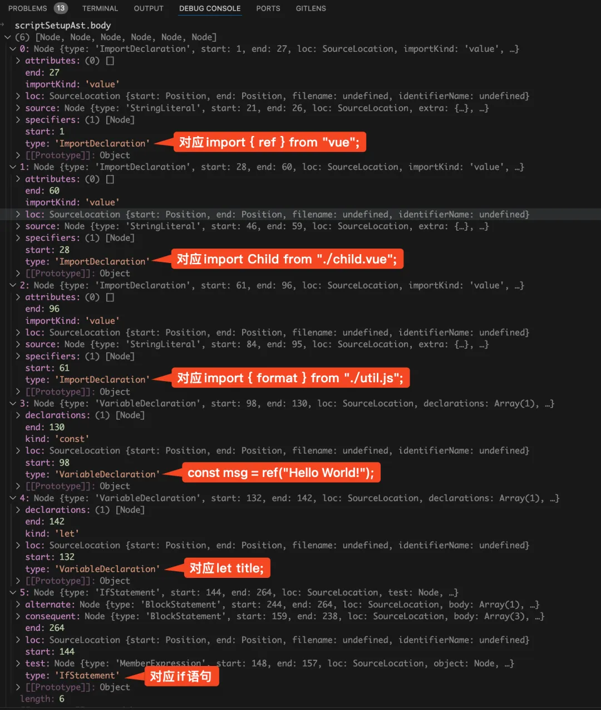
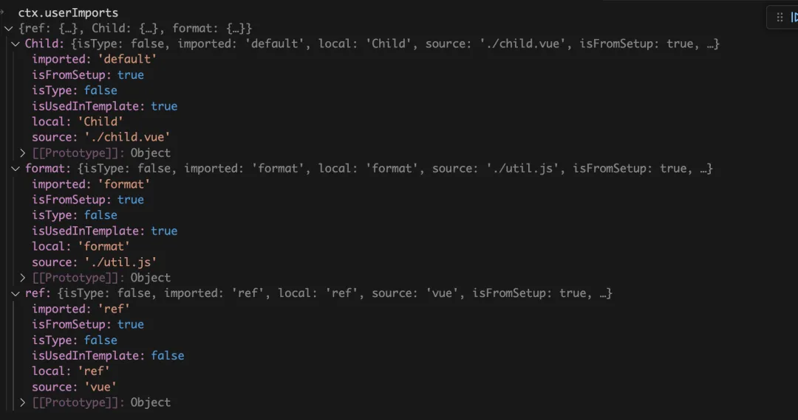
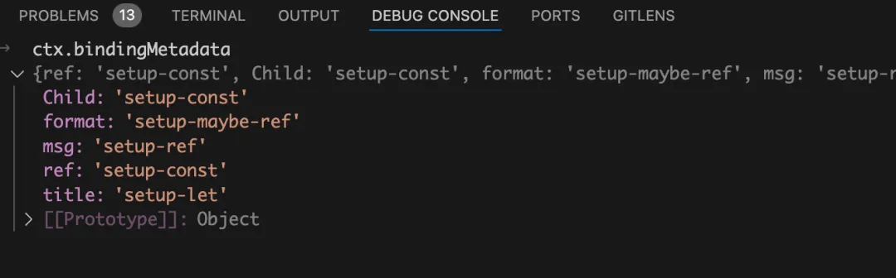

# `<script setup>`的一些理解
> 主要内容来自一个问题:**为什么Pinia setup function还要将定义的所有return出去,而Vue SFC的`<script setup>`就不用了?**  
> 然后自己就去玩了.
> https://play.vuejs.org  
> 试着各种Macro,API,在编译后都变成什么样吧.

## `<template>`
类似React Class Component,一个单文件Vue组件可以理解为一个对象:`__sfc__`.  
`<template>`对应的是`render()`函数,其它状态/方法,可以理解为对象上的属性.  
先上代码吧:
```js
// 一个只有模板的,没有任何和Vue相关内容的SFC,长这样:
const __sfc__ = {};
function render(_ctx, _cache) {
  return " 12345 "
}
__sfc__.render = render
__sfc__.__file = "src/App.vue"
export default __sfc__

// const __sfc = {
//     render(){/** */},
//     __file:'src/App.vue',
// }
```
能从以上知道什么呢?你又是否能了解模板原本是什么内容呢?  
1. 一个`render`函数,返回字符串`12345`.
2. 该函数作为对象属性添加到了对象上
3. 为对象添加`__file`属性,没错,这就是文件的名称.(是否用了别名这里会发生变化?)

## `<script>`没有setup
Vue3初期是没有`setup`这个语法糖的,定义的所有响应式内容都需要从`setup()`函数返回出去,这样模板才能读取到对应的值:
```vue
<script>
    import { defineComponent, ref } from 'vue';
    export default defineComponent({
        setup(){
            const msg = ref('Hello');
            return {
                msg
            }
        }
    })
</script>
<template>
{{ msg }}
</template>
```
如此,编译后的文件又会变成什么样呢?


```js
import {ref,defineComponent} from 'vue'
const __sfc__ = defineComponent({
    setup(){
        const msg = ref('hello world');
        return {
            msg
        }
    }
});
import { toDisplayString as _toDisplayString } from "vue"
function render(_ctx, _cache, $props, $setup, $data, $options) {
  return _toDisplayString(_ctx.msg)
}
__sfc__.render = render
__sfc__.__file = "src/App.vue"
export default __sfc__
```

可以说是毫无变化了,对`__sfc__`这个对象的定义,就是`defineComponent()`内的对象.  
可见一斑了,`<script setup>`的作用:`defineComponent`,除了`setup()`函数以外的东西,你没有定义,Vue自己就给它添加上一些默认值.  

## 有了`<script setup>`
用`defineComponent`定义一个没有利用语法糖的组件,编译后的代码是这样的:
```js
// Comp.vue
import { defineComponent,ref } from 'vue';
const __sfc__ = defineComponent({
  name:'Foo',
  setup(){
  const withoutReactive = 'something constant';
  const age = ref(11)
  return {
    withoutReactive,
    age
  }
}
})
```
用了语法糖后,代码就变这样了:
```js
// App.vue
import {ref} from 'vue';
import Foo from './Comp.vue'
  
const __sfc__ = {
  __name: 'App',         [!code highlight]
  setup(__props, { expose: __expose }) {
  __expose();

  const msg = ref('hello world')

    const __returned__ = { msg, ref, Foo }
    Object.defineProperty(__returned__, '__isScriptSetup', { enumerable: false, value: true })
    return __returned__
}
```
发现了个差异点:
`defineComponent`需要注册组件:  
1. 传个对象,编译结果也还是对象;
2. 在`render`函数内有`const _component_Foo = _resolveComponent("Foo")`这个步骤,之后为这个结果`_createVNode(_component_Foo)`.  

`setup`语法糖不用注册了,直接导入就行
1. 将这个组件,放到了`__sfc__.__returned__`这个对象上;
2. 渲染的时候用的方法是`createVNode($setup["Foo"])`,而少了中间变量了.

`$setup["Foo"]`,是不是可以理解为:用了语法糖后,Foo组件的定义作为属性添加到这个参数上了?
`_createVnode`接收的参数是怎样的?  `_resolveComponent("Foo")` 和 `$setup["Foo"]`又有什么区别?

先暂停一下去看下官网吧.  
翻译完了,跟原理没什么关系,只是多知道了一些`<script setup>`里的用法.  
::: tip
[自荐一下吧,自己翻译的官网script setup的内容](./SetupScript.md)
:::

***
目前的困难及自己尝试的办法是,clone了Vue Core,尝试解决为`__sfc__`添加了个`__returned__`对象,模板内就能直接使用`<script setup>`里定义的变量及方法.  
结果?? 找到只是个模板字符串???似乎只是用于展示而不是解释为什么要这么做...  
所以问题还是一样的:**为什么`<script setup>`里不用返回,模板就能用到里面的变量?**  

找到篇解释类似问题的文章,先阅读一下,记录一下阅读之前的一些疑惑,并**学习一下别人是怎么学习原理的**.(直接Clone这条路还有很长要走..)  
> 作者:前端欧阳  
> [有点儿神奇，原来vue3的setup语法糖中组件无需组册因为这个](https://cloud.tencent.com/developer/article/2433540)
> 有点没看完就贴的意思了.上文主要说的是setup里能直接用import而不需要注册的一些原理.  
> 看到其中才知道作者有其它解释我的疑问的文章.  
> [有点东西，template可以直接使用setup语法糖中的变量原来是因为这个](https://mp.weixin.qq.com/s?__biz=MzkzMzYzNzMzMQ==&mid=2247485123&idx=1&sn=c4d39d1ae31c8dbadae193d4e41fa734&scene=21#wechat_redirect)

先说一下自己翻源码看得懂的一些解释吧.  
## `compileScript()`
对应的有`compileTemplate()`函数.但目前还是想弄清楚`__returned__`对象的作用.  

### 编译过程
有两个绑定对象和两种编译过程,分别对应不使用语法糖时,以及使用了语法糖时编译的内容:
```ts
const scriptBindings : Reord<string, BindingTypes> = Object.create(null);
const scriptAst = ctx.scriptAst;
const setupBindings : Reord<string, BindingTypes> = Object.create(null);
const setupAst = ctx.scriptSetupAst!
if(scriptAst){/* */}
// other codes of compiling setupAst.
```

然后研究一下`__returned__`这个对象,似乎是在这里判断模板内是否用到`setup`里的变量,是否需要unwrap.  
感觉代码不是很多,直接粘贴下来再逐步解释一下自己的理解吧.(理解不一定正确,以你的理解为准~)
```ts
// 9. generate return statement
  let returned
  if (
    !options.inlineTemplate ||
    (!sfc.template && ctx.hasDefaultExportRender)
  ) {
    
    // non-inline mode, or has manual render in normal <script>
    // return bindings from script and script setup
    // 非行内模式,或者在<script>标签内使用自定义的render函数.
    // 从这里整合,由script和script setup返回的,所有绑定值
    const allBindings: Record<string, any> = {  
      ...scriptBindings,   
      ...setupBindings,
    }

    //判断用户导入的import语句,是否在模板中用到,从而判断是否需要return出去.
    for (const key in ctx.userImports) {
      if (
        !ctx.userImports[key].isType && // [!code highlight]
        ctx.userImports[key].isUsedInTemplate          // [!code highlight]
        // 导入的,不是ts的type,以及在模板中用到了,则标记`allBinding['someValue'] = true`
      ) {
        allBindings[key] = true
      }
    }
    returned = `{ `    // 对象开头的`{`
    for (const key in allBindings) {
      if (
        allBindings[key] === true &&
        ctx.userImports[key].source !== 'vue' &&
        !ctx.userImports[key].source.endsWith('.vue')     
      ) {
        // generate getter for import bindings
        // skip vue imports since we know they will never change  //后两个判断的用意,从Vue导入的内容,或以`.vue`结尾的源内容不会被改变.
        returned += `get ${key}() { return ${key} }, `
      } else if (ctx.bindingMetadata[key] === BindingTypes.SETUP_LET) {
        // local let binding, also add setter
        const setArg = key === 'v' ? `_v` : `v`
        returned +=
          `get ${key}() { return ${key} }, ` +
          `set ${key}(${setArg}) { ${key} = ${setArg} }, `
      } else {
        returned += `${key}, `
      }
    }
    returned = returned.replace(/, $/, '') + ` }`        // $是字符串结尾的意思, 这是去除对象最后的逗号,并补全对象, 开头的`{`, 这里的`}`,作为对象结尾.
  } else {
    // inline mode
    // .. 省略了一大段,处理行内模式的代码
  }
```

怎么判断是否在模板中被用到? 去看看?
`allBindings`对象长什么样? `__returned__`又是怎样的?
### `allBindings`
内容有点多,提取出来再解释吧:
```ts
    const allBindings: Record<string, any> = {  // Record<string,any> 限定, 是个属性值是字符串,值是任意值的对象
      ...scriptBindings,   
      ...setupBindings,
      // 而解构的对象类型都是, Record<string,BindingTypes>   
      // BindingTypes 是个enum. 
    }
    export enum BindingTypes {
      DATA = 'data',
      PROPS = 'props',
      PROPS_ALIASED = 'props-aliased',
      SETUP_LET = 'setup-let',
      SETUP_CONST = 'setup-const',
      SETUP_MAYBE_REF = 'setup-maybe-ref',
      SETUP_REF = 'setup-ref',
      OPTIONS = 'options',
      LITERAL_CONST = 'literal-const',
}
```
所以,一个`const count = ref(0)`会被编译成:
```ts
const setupBindings = {
  'count': 'setup-ref'
} 
```

---
以下是跟vue playground里看到的,完全一样的代码.疑似仅用于编译器展示,实际细节还是上面的代码.
```ts
  if (!options.inlineTemplate && !__TEST__) {
    // in non-inline mode, the `__isScriptSetup: true` flag is used by
    // componentPublicInstance proxy to allow properties that start with $ or _
    ctx.s.appendRight(
      endOffset,
      `\nconst __returned__ = ${returned}\n` +
        `Object.defineProperty(__returned__, '__isScriptSetup', { enumerable: false, value: true })\n` +
        `return __returned__` +
        `\n}\n\n`,
    )
  } else {
    ctx.s.appendRight(endOffset, `\nreturn ${returned}\n}\n\n`)
  }
```
### 为什么Compiler Macros不用显式引入就能直接使用?
首先`<script setup>`语法糖的一个优点就是,一些编译器宏不需要导入就能直接使用.  
这些宏包括以下:
* `defineProps`,`defineEmits`,`defineOptions`,`defineSlots`
* `defineExpose`
* `defineModel`  
(为什么会被分成三类呢?因为后续的处理方式是依据以上分类进行的.)  
简单说,第一类是处理完后,直接`remove()`掉.第二类是在上下文中添加`__expose`,第三类是新定义,专门的`processDefineModel`函数处理.  
以下是源码,似乎这类宏的类型定义是'ExpressionStatement'
```ts
  for (const node of scriptSetupAst.body) {
    if (node.type === 'ExpressionStatement') {
      const expr = unwrapTSNode(node.expression)
      // process `defineProps` and `defineEmit(s)` calls
      if (
        processDefineProps(ctx, expr) ||
        processDefineEmits(ctx, expr) ||
        processDefineOptions(ctx, expr) ||
        processDefineSlots(ctx, expr)
      ) {
        ctx.s.remove(node.start! + startOffset, node.end! + startOffset)
      } else if (processDefineExpose(ctx, expr)) {
        // defineExpose({}) -> expose({})
        const callee = (expr as CallExpression).callee
        ctx.s.overwrite(
          callee.start! + startOffset,
          callee.end! + startOffset,
          '__expose',
        )
      } else {
        processDefineModel(ctx, expr)
      }
    }
//...
}
```

### 新的一天,新的理解
`compileScript`这里的内容我感觉可以理解一年.每次看都有新的收获.  
现在再认识到的是,这个函数将一整个`vue`文件划分成三部分:`template`,`script`,以及`style`.对应功能显而易见.我们则需要在这里遍历`script`内容.  

* 遍历出`import`语句
* 遍历出变量及绑定
* 将在模板中用到的变量或组件返回出去.
(又有问题了,为什么`script`内容需要return出去`template`才能访问到?)  

#### 去除除script外的内容
从最"容易"理解的代码开始吧,将`script`以外的内容先去除掉:
```ts
 if (script) {
    if (startOffset < scriptStartOffset!) {
      // <script setup> before <script>  // script之前的setup <script setup>here</script><script></script>
      ctx.s.remove(0, startOffset)
      ctx.s.remove(endOffset, scriptStartOffset!)
      ctx.s.remove(scriptEndOffset!, source.length)
    } else {
      // <script> before <script setup>  //    <script>here</script><script setup></script>
      ctx.s.remove(0, scriptStartOffset!)
      ctx.s.remove(scriptEndOffset!, startOffset)
      ctx.s.remove(endOffset, source.length)
    }
  } else {
    // only <script setup>       //只有<script setup>
    ctx.s.remove(0, startOffset)     // 可以看出,<script></script>对应的内容是(scriptStartOffset,scriptEndOffset)
    ctx.s.remove(endOffset, source.length)    // <script setup></script>对应是(startOffset,endOffset).因此这段代码里只有语法糖,没有单纯<script>标签.
  }
```

可能用图片更容易理解,*代码稍有不同,但用于展示这段代码执行前后结果  
执行`remove()`之前:


执行`remove()`之后:

可以看到,`import`语句被提升到`script`以外了,`template`没了.`style`如果有也会被移除.

#### `sfc`长什么样?
除了`sfc`长什么样,还需要知道一个"大对象",`ctx`是什么.  
先解释一下二者关系, `ctx`的生成依赖于`sfc`.
```ts
export function compilerScript(sfc:SFCDescriptor, options:SFCCompileOptions){
  //...
    const ctx = new ScriptCompileContext(sfc,options); 
  // ....
}
```
回到正题,`sfc`长这样:

主要的属性有以下:
* `content`: **`<script setup>`内的字符串**
* `scriptSetup.start`,`scriptSetup.end`: `<script setup>`标签在文件中的起始和结尾位置.对应先前的就是,`startOffSet`和`endOffset`
* `source`:**vue文件中所有的代码.顺序无任何变化**

主体应该是`ctx`,但我却理解`sfc`去了.那生成`ctx`的作用又是什么呢?

#### 遍历`<script>`的内容
简单说是分别遍历两棵抽象语法树,一棵由`<script>`生成的`scriptAst`;一棵由`<script setup>`生成的`scriptSetupAst`;

生成的AST是怎样的呢? 是怎么生成的呢?(后面又是另外的问题了)
```vue
<template>
  <h1>{{ msg }}</h1>
  <h2>{{ format(msg) }}</h2>
  <h3>{{ title }}</h3>
  <Child />
</template>

<script lang="ts" setup>
import { ref } from "vue";
import Child from "./child.vue";
import { format } from "./util.js";
const msg = ref("Hello World!");
let title;
if (msg.value) {
  const innerContent = "xxx";
  console.log(innerContent);
  title = "111";
} else {
  title = "222";
}
</script>

```

可以看到是个数组,每一项对应的是`script`内的每一行.

```ts
if(scriptAst){
  for(const node of scriptAst.body){/** */}
}
for(const node of scriptSetupAst.body){
  /** */
}
// ... 两次遍历都有的代码,将两种类型的script内的语句进行分类处理
if (
        (node.type === 'VariableDeclaration' ||
          node.type === 'FunctionDeclaration' ||
          node.type === 'ClassDeclaration' ||
          node.type === 'TSEnumDeclaration') &&
        !node.declare
      ) {
        walkDeclaration(
          'script',
          node,
          scriptBindings,
          vueImportAliases,
          hoistStatic,
        )
      }
```


::: details
**怎么将导入语句提升到顶层作用域的呢?**  
此时的相同点是:   
**`import`语句的类型都是:`ImportDeclaration`. => `node.type === 'ImportDeclaration'  // true**  

有语法糖时较为简单,有工具函数`hoistNode(node)`;  
无语法糖时较为麻烦,需要遍历`node.specifiers`,也还要用额外的工具函数`registerUserImport()`  
其实`hoistNode()`内部也调用了`registerUserImport()`.都需要将这些引入语句放到`ctx.userImports`内.上面两个语句是不完全认识.  
引入的语句,即`ctx.userImports`经处理后,长这样:

这里看到上文提到的两个属性了:`isType`和`isUsedInTemplate`.用以判断是否需要将它们返回出去.
:::

莫名奇妙解决了一个问题:为什么非顶层的变量声明不能直接用在`<template>`中,比如上面声明的`innerContent`?  
答: 语句类型被判定为`IfStatement`了.不执行`walkDeclaration`.自然`template`里面不能使用这个变量.(walkDeclaration执行了什么?)  

之后回顾一下`__returned__`对象的生成: 
```ts
const allBindings = {
  ...scriptBindings,
  ...setupBindings
}
  for (const key in scriptBindings) {
    ctx.bindingMetadata[key] = scriptBindings[key]
  }
  for (const key in setupBindings) {
    ctx.bindingMetadata[key] = setupBindings[key]
  }
```
目前没完全理解的是,`ctx.userImports`和`ctx.bindingMetadata`的作用是什么?
* `userImports`用于存储所有导入内容(包括从`vue`导入的`ref`)
* `bindingMetadata`的作用是存储所有的顶层绑定.因为`setupBindings`和`scriptBindings`内容既可以是顶层变量,还可以是访问器属性getter/setter.(?这是解释吗?)

生成的`ctx.bindingMetadata`长什么样呢?

是各条语句的名称及类型.

之后生成`__returned__`对象,完善`setup()`函数,导入一些Vue helpers函数,最终生成编译后的代码文件.
