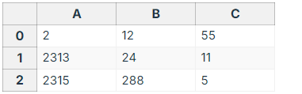

# Reactivity in Depth
> https://vuejs.org/guide/extras/reactivity-in-depth.html#what-is-reactivity  
> 官网内容

Vue的一个最大特点就是它的响应性系统了,也就是由响应性Javascript对象组成组件状态.简单说响应性是,当你改变某个状态,视图也会随之发生变化.  
这样的行为能使状态管理变得更加直观,更为简单.不过也由于它是Vue的一大特性,了解它工作的底层,避免一些常见的错误,也是变得相当有必要了.  
在本篇介绍中,我们将深入了解,Vue响应性系统的底层实现逻辑.

## 什么是响应性?(reactivity)
这个词在编程界出现了好一会了,但它实际的意思到底是什么呢?响应式其实是一种编程范式(programming paradigm),我们可以用声明式的方法来调整一些变化.最经典最为人所知的响应式例子,大概就是Exel的单元格了.(spreadsheet)

上图中,A2单元格的内容定义为`= A0 + A1`, 因此对应结果则为前两个单元格的和.很正常对吧.不过,神奇的是,当你改变A0或A1的值后,你会发现A2的值也会随之自动更新.  
为什么说神奇呢?因为Javascript本身是不会像以上那样自动为你更新的.  
具体用代码来说明就是:
```js
let A0 = 1;
let A1 = 2;
let A2 = A0 + A1;

conosle.log(A2) // 3
A0 = 2; 
console.log(A2); //仍旧是3
```
当我们改变`A0`值时,`A2`的值没有发生变化.  
所以要JS实现类似功能的话要怎么做呢?要为`A2`重新赋值,我们可以将对应更新语句包裹在一个函数之中:
```js
let A2;
function update(){
    A2 = A0 + A1;
}
```
之后我们来定义一些术语:
* 这个`update()`函数,产生了一个**副作用(side effect),或直接说是作用(effect)**,因为它改变了我们程序的状态.
* `A0`和`A1`是这个副作用的**依赖项(dependencies)**,因为它们的值被用来产生这个副作用了.而这个副作用,对于它们的依赖而言,又被称为**订阅者(subscriber)**.  

当`A0`或`A1`的值发生改变时,我们需要一点点"魔法",来调用这个`update()`副作用:
```js
whenDepsChange(update);
```
这个`whenDepsChange()`函数需要完成以下工作:
1. 某个变量被读取时,追踪该变量.比如执行到表达式`A0+A1`,表明`A0`,`A1`都被读取到了.
2. 如果当前副作用的一个变量被读取时,这个副作用需要成为这个变量的订阅者.比如,`update()`的执行会读取到`A0`和`A1`的值,`update()`就要在首次执行后,成为`A0`和`A1`的订阅者.
3. 检测变量变化.比如当`A0`被重新赋值,`whenDepsChange()`就要通知它的所有订阅者都重新运行.

## Vue中的响应式是如何实现的
Vue并不能像例子那样,真正实现跟踪本地变量的读取和修改操作.JS原生并没有实现的机制.不过,**我们可以在读取和修改对象属性时,进行拦截工作**,从而实现类似的功能.  

JS中实现拦截属性访问的方法有两种:`getter/setters`访问器属性,和`Proxies`代理.  
Vue2由于浏览器兼容的限制,专门使用了`getter /setters`实现响应性.而到了Vue3,我们改用了`Proxies`实现响应式对象,而用`getter/setters`实现`refs`响应式.  
以下是一些实现响应性的伪代码:
```js
function reactive(obj){
    return new Proxy(obj,{
        get(target,key){
            track(target,key) // [!code highlight]
            return target[key]
        },
        set(target,key,value){
            target[key] = value
            trigger(target,key) // [!code highlight]
        }
    })
}

function ref(value){
    const refObject = {
        get value(){
            track(refObject, 'value') // [!code highlight]
            return value
        },
        set value(newValue){
            value = newValue;
            trigger(refObject,'value'); // [!code highlight]
        }
    };
    return refObject;
}
```

::: tip
这里及以下的代码都只是用最简单的方法,来展示响应式工作的核心原理,许多实现的细节和边缘案例其实都被忽略掉了.
:::

这也解释了一些在基础部分讨论过的,[响应式对象的限制](https://vuejs.org/guide/essentials/reactivity-fundamentals#limitations-of-reactive):
* 如果你要将响应式对象的属性赋值给一个本地变量, 或直接从响应性对象的属性解构时,那个得到的结果就会**失去响应式**了,因为它不会再触发源对象上`get/set`函数.  
**这里的"失去响应性"只会影响变量绑定 -- 如果变量指向的是类似对象那样的,非原始类型值,那这个变量还是具有响应式的.**
* `reactive()`返回的代理尽管跟原生的行为相似,但如果你用`===`操作符对原生`proxy`进行比较的话,得到的还是不等的结果(different identity)  

`track()`函数内会检查当前是否有正在运行的副作用.如果有,它就会为当前被跟踪的属性查找存在`Set`结构里的订阅者副作用,并将该副作用添加到`Set`里面:
```js
// 这会在副作用即将被执行前设置好.我们后续再来处理
let activeEffect;
function track(target,key){
    if(activeEffect){
        const effects = getSubscriberForProperty(target,key);
        effect.add(activeEffect);
    }
}
```
副作用的订阅会被存于一个全局的`WeakMap<target,Map<key,Set<effect>>>`,结构中.如果某个属性找不到对应订阅的副作用集,那就为它创建一个.这就是`getSubscriberForProperty`函数作用的简要介绍.为了简便,我们就忽略它实现的细节了.  
而在`trigger()`函数内,我们再次为对应属性查找副作用订阅器.但这一次不仅是查找了,我们还会调用它们.
```js
function trigger(target,key){
    const effects = getSubscriberForProperty(target,key);
    effects.forEach(effect => effect());
}
```
绕了一圈,回到我们的`whenDepsChange()`函数去:
```js
function whenDepsChange(update){
    const effect = () => {
        activeEffect = effect;
        update();
        activeEffect = null;
    };
    effect()
}
```
目前的定义是,把`update()`直接包在了一个副作用里,在真正执行这个副作用前先把它设置为`activeEffect`.这样就能在更新的时候,让`track()`函数定位到当前活跃的副作用了.(?)  
到这里我们就创建好了自动跟踪依赖,依赖变化时重运行的副作用了.我们称之为**响应式作用(Reactive Effect)**.  
Vue本身提供一个API,让你自己也能创建响应式副作用,就是`watchEffect()`.实际上你会发现这个API的工作原理,跟我们上面例子使用的`whenDepsChange()`很像.那就用真实的API来重写一下上面的例子吧:
```js
import { ref, watchEffect } from 'vue';
const A0 = ref(0);
const A1 = ref(1);
const A2 = ref();

watchEffect(() => {
    // 跟踪A0和A1;
    A2.value = A0.value + A1.value;
})
// 触发副作用
A0.value = 2
```
用响应式副作用来改变ref并不是最好的使用例子 -- 实际上,用计算属性来实现能更加具有声明式(declarative),作用更加明了.
```js
import { ref, computed } from 'vue';
const A0 = ref(0);
const A1 = ref(1);
const A2 = computed(() => A0.value + A1.value);

A0.value = 2;
```
其实`computed`内部自身使用响应式管理数值的是否失效或重计算.  
所以到底常见及有效的响应式作用场景是什么呢?好吧其实是更新DOM!我们可以这样实现简单的"响应式渲染":
```js
import { ref, watchEffect } from 'vue';
const count = ref(0);
watchEffect(() => {
    document.body.innerHTML = `Count is ${count.value}`
});
count.value++;
```
其实到了这里,我们已经相当接近了解Vue组件真实维持状态和视图一致的原理了 -- 每个组件实例都会创建响应式作用,以渲染和更新DOM.当然了,接近终究是接近,实际上的更新方法更为高效,而不是直接使用`innerHTML`.[更多相关可看渲染机制部分](https://vuejs.org/guide/extras/rendering-mechanism)

## 运行时和编译时的响应式
Vue的响应式系统主要是基于运行时(runtime-based)实现的:跟踪和触发的功能都在代码直接在浏览器中运行时表现出来.运行时响应式的一个优点是,它可以跳过构建阶段(build step),以及这样能处理更少的边缘案例.不过,这也导致具体的实现受制于JS语法,比如你不得不在script里用`.value`才能访问到`ref`变量.  
一些像Svelte框架那样,为了突破这些语法限制,采用了编译时响应式的方法(compile-time reactivity).框架会分析并转化代码来模仿实现响应式的功能.而且有了编译阶段,框架本身就能"改变"一些JS的语法了 -- 比如隐式地注入一些代码,从而在读取局部定义地变量时实现依赖收集,副作用触发功能.而缺点是这样做依赖于构建阶段,而且改变JS语法实质上已经是创建了一种看似JS,编译结果又像其它的语言了.  
Vue团队确实有探讨过这个方向,究竟是运行时响应式好还是编译时响应式好,也推出了相关实验性功能:[响应式转变](https://vuejs.org/guide/extras/reactivity-transform).但最终我们还是采取了前者,[相关解释在另外的文章了](https://github.com/vuejs/rfcs/discussions/369#discussioncomment-5059028).  

## 响应式调试
Vue的响应式能自动跟踪依赖,但有时我们需要知道,到底哪些依赖被收集了,或者说,导致组件重渲染的原因到底是什么?

### 组件层面的调试Hooks
我们可以利用`onRenderTracked`和`onRenderTriggered`两个生命周期hooks,调试清楚组件渲染时调用了哪些依赖,以及哪些依赖等更新导致视图的更新.两个hooks都接收一个debugger事件,其中包括有疑问的依赖信息.我们建议直接在回调函数中直接采用`debugger`语句从而交互式地检验相关依赖.
```vue
<script setup lang='ts'>
import { onRenderTracked, onRenderTriggered } from 'vue';
onRenderTracked(e => {
    debugger
});
onRenderTriggered(e => {
    debugger
})
</script>
```
::: tip
组件层面的调试hooks**只在开发模式下**有用.
:::

调试事件的对象具体有以下参数类型:
```ts
type DebuggerEvent = {
    effect: ReactiveEffect
    target:object
    type:
    | TrackOpTypes /**'get' | 'has' | 'iterate'  */
    | TriggerOpTypes /**'set' | 'add' | 'delete' | 'clear' */
    key: any
    newValue?: any
    oldValue?: any
    oldTarget?: Map<any,any> | Set<any>
}
```

### 计算属性的调试
我们可以给`computed()`函数传第二个参数,一个具备两个回调函数的对象:`{onTrack:function , onTrigger:function}`
* `onTrack`会在某个响应式属性或`ref`被收集为依赖时被调用
* `onTrigger`会在依赖变化导致监视器回调(watcher callback)被调用时,被调用.  

两个回调函数的参数跟上面两个hooks的事件对象一致:
```js
const plusOne = computed(() => count.value+1,{
    onTrack(e){
        // 当count.value被收集为依赖时触发
        debugger
    },
    onTrigger(e){
        // count.value发生变化时被触发
        debugger
    }
})
// 读取pluseOne,触发onTrack
console.log(plusOne.value);

// 改变count.value,触发onTrigger
count.value ++;
```

::: tip
同样,调试功能仅在开发模式下有效.(computed仅在开发模式下接收两个参数并正常工作).
:::

### 监视器调试
与`computed()`类似,监视器也支持`onTrack`和`onTrigger`选项:
```js
watch(source,callback,{
    onTrack(e){
        debugger
    },
    onTrigger(e){
        debugger
    }
});

watchEffect(callback,{
    onTrack(e){
        debugger
    },
    onTrigger(e){
        debugger
    }
})
```
仅开发模式下可用.

## 与外部状态管理系统的整合
Vue的响应式系统通过将JS对象深度转变为响应式代理来实现.这种转变在与一些外部状态管理系统时可能是不必要,甚至是不想要的.(比如外部的解决方案也是采用了Proxies)  
一般遇到这种情况,我们建议的解决方法是将外部状态包裹在`shallowRef`中.它的作用是仅当对象的`.value`属性被访问时才会是响应式的-- 内部值不会发生其它变化.当外部状态变化时,将ref的值替换掉来触发更新(?).

### 不可变数值
如果你要实现撤回/重做的功能,你就可能想要为每次用户编辑状态时,给应用的状态照个快照(snapshot).然而Vue直接改变数据的响应式系统显然不是这个场景下的最佳选择,因为当状态树比较庞大时,将整个状态对象都进行序列化更新将会耗费大量的CPU和内存资源.  
不可变数据解决这个问题的办法就时,不允许对状态对象进行直接修改 -- 直接用新的替换掉旧的.JS中使用不可变数据的方式有很多,我们推荐的解决方法是使用[Immer](https://immerjs.github.io/immer/),因为它引入了这个功能的同时,保留了更多便于理解,可变化的语法.  
我们简便地利用复合函数整合Immer和Vue:
```js
import { produce } from 'immer'
import { shallowRef } from 'vue'
export function useImmer(baseState){
    const state = shallowRef(baseState);
    const update = updater => {
        state.value = produce(state.value,updater)
    };
    return [state,update]
}
```

### 状态机
状态机是描述一个应用所有可能处于的状态,以及所有它可以转变到的状态的模型.对于简单的组件而言显然功能过剩了,但它的作用则是让复杂的状态流更为健壮,更加可管理.  
JS中最为著名的状态机实现方式之一是:[XState](https://xstate.js.org/).以下是将其整合到Vue的一个复合函数:
```js
import { createMachine, interpret } from 'xstate';
import {shallowRef} from 'vue';

export function useMachine(options){
    const machine = createMachine(options);
    const state = shallowRef(machine.initialState);
    const service = interpret(machine).onTransition(newState => (state.value = newState)).start();
    const send = e => service.send(e);

    return [state,send]
}
```

### RxJS
RxJS是一个异步事件流的工作库.[VueUse](https://vueuse.org/)库有个专门的插件`@vueuse/rxjs`实现`RxJS`和Vue响应系统的整合连接.

## 与Signals的联系
很多其它框架也使用了类似Vue响应式概念的东西,它们把这个概念称之为"信号"(Signals):
* [Solid Signals](https://www.solidjs.com/docs/latest/api#createsignal)
* [Angular Signals](https://angular.io/guide/signals)
* [Preact Signals](https://preactjs.com/guide/v10/signals/)
* [Qwik Signals](https://qwik.builder.io/docs/components/state/#usesignal)

从底层上讲,signals跟Vue refs属于同一类的响应式原始值.都是一个值容器,里面提供了读取时收集依赖,修改时触发依赖的功能.这种基于原始值的响应式范式在前端世界里已经不是什么新概念了:  
从`Knockout`的`observables`,到`Meteor`的`Tracker`,十多年前就有类似的功能实现了.Vue Option API和React管理库MobX都是基于相同的原则所构建的,只是把原始值替换成了对象属性.  
尽管如今我们没有必要特别区分某个值是否为signal,但我们在讨论通过订阅者模式实现更新的渲染模型时,通常也会带上这个概念.  
由于Vue使用了虚拟DOM,因此现在仍旧需要依赖编译器来实现相似的优化.不过我们在探索一种受`Solid`框架启发,新的编译策略:`Vapor Mode`.它不依赖于虚拟DOM,能更好地配合Vue响应式系统工作.

### API的设计取舍
Preact和Qwik里的signals概念,跟Vue的`shallowRef`非常相似:三个API都提供一个`.value`的属性来改变值.我们会在以下Solid和Angular Signals中讨论更多相关内容.
#### Solid Signals
Solid中的`createSignal()`强调读写分离.创建出来的信号分为一个只读的`getter`,和一个单独的`setter`:
```js
const [count,setCount] = createSignal(0);
count(); // 读取count值. //?
setCount(1) // 更新signal
```
可以看到这里的`count`在没有setter时也可以被传递.(?passed down)这样就能确保这个状态,只有在对应setter也被暴露时才能被修改.  
这种方法是确保了类型安全,还是添加了更多不必要的语法,取决于你的看法,或是项目的需要了 -- 不过如果你想在Vue复刻相似的风格,当然也是可以的:
```js
import { shallowRef, triggerRef } from 'vue';
export function createSignal(value,options){
    const r = shallowRef(value);
    const get = () => r.value;
    const set = (e) => {
        r.value = typeof v === 'function'?v(r.value) :v;
        if (options?.equals === false) triggerRef(r)
    };
    return [get,set];
}
``` 

#### Angular Signals
Angular当前在进行一些底层变化,放弃了脏值检测并推出了自身实现的响应式原始值.Angular Signal API的实现类似于以下:
```js
const count = signal(0);
count(); // 读取该值
count.set(1); // 设置一个新值
count.update(v => v+1); // 基于先前的值进行更新

```
再用Vue复刻,大概以下这样:
```js
import {shallowRef} from 'vue';
export function signal(initialValue){
    const r = shallowRef(initialValue);
    const s = () => r.value;
    s.set = (value) => {
        r.value = value;
    };
    s.update = (updater) => {
        r.value = updater(r.value);
    };
    return s;
}
```

与Vue refs相比,Solid和Angular基于`getter`实现的API风格,如果用在Vue组件的话,有好有坏:
* `()`可能比`.value`稍稍没那么冗余,但如果要对值进行更新,明显就要更多的代码了
* ref就无法被解包装(ref-unwrapping)了:读取值时总是要通过`()`.这样能确保读取方式的一致.也表明你可以将原生的signal左右props传递给组件.

以上API风格你是否喜欢,是一件相当主观的事情.我们在这里列举出来,是想阐明这些API的底层相似,以及对应的得失.同时也想向你展示,Vue是相当灵活的:你并非真正受制于Vue为你提供的API.  
出于您的需要,你可以自行创建适应你需求的,新的响应式系统.